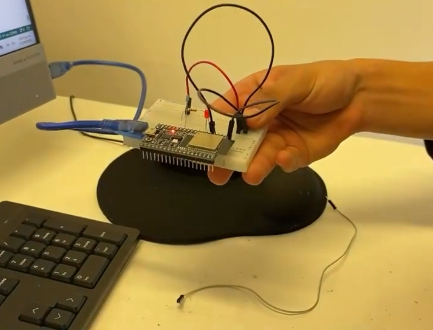

#Segundo Proyecto

###Nombre del proyecto: MCU 101

###Autores
- Barrientos Miguel Leonardo
- Zermeño Cervantes Rodrigo

###Asignatura: Introducción a la Mecatronica

###Fecha: 12 de Septiembre del 2025

###Descripción
Con los componentes electronicos que teniamos (Arduino ,Jumpers,Protoboar,etc)tenemos que lograr que un foco led se encienda y se apague programando nuestro arduino desde la computadora.


##Objetivos
###General
En este segundo proyecto  de "Introducción a la Mecatronica" pretendiamos lograr realizar un circuito programando  un "Arduino"  para que un led se encendiara y apagara dependiendo de las indicaciones del codigo que diseñamos durante la clase.
###Especificos
-OE1:Como objetivo especifico,ambos buscamos tener un desempeño superior al del primer proyecto,nuevamente tuvimos la mentalidad del poder ampliar nuestros conocimientos para tener un mejor desempeño en los proyectos que realizaremos en un futuro.
##Alcance y Exclusiones
 -**Incluye**: Todos los codigos que utilizamos para cada uno de los circuitos que realizamos junto a fotografias de cada circuito

 -**No Incluye**: foto especifica de los materiales ocupados, sin embargo es posible visualizarlos en las fotografías.

##Procedimiento 1
Lo primero que hicimos fue revisar todo nuestro material  de de trabajo y con una breve introducion de como utilizar nuestro arduino realizamos un circuito el cual estaria conectado a nuestro principal material de trabajo el "Arduino",acto siguiente realizamos un codigo el cual su principal funcion era encender y apagar nuestro led con un pequeño "delay" para lograr precibir  el momento en del encendido y apagado del led

---

##Codigo 1:
```cpp
const int led=33; // Puerto del arduino al que esta conectado el led
 
void setup() {

  Serial.begin(115200);

  pinMode(led, OUTPUT);
 
}
 
void loop() {  // Repeticion constante del encendido y apagado

     digitalWrite(led,1); //Encendido

     delay(1000); // Retraso del encendido y apagado del led

     digitalWrite(led,0); //Apagado

     delay(1000);
 
  }
```


Captura de pantalla del video en el momento en que el foco estaba apagado.


Captura de pantalla del video en el momento en que el foco esta encendido.

##Procedimiento 2

Tomando como base nuestro primer codigo y circuito, realizamos unos cambios en ambas cosas.Primero le agregamos un boton al circuito con el cual buscabamos encender y apagar el led cuando lo presionaramos,este lo agregamos en el puerto "34" de nuestro arduino.Entonces para que el circuito funcionara tuvimos que agregar otra constante al codigo,agregamos una entrada y pusimos condicionales para cuando presionaramos el boton el led se encendiera y cuando no este permaneciera apagado.

##Codigo 2:
```cpp
const int led=33; // LED

const int btn=34; // BOTON
 
void setup() {

  Serial.begin(115200);

  pinMode(led, OUTPUT); // SALIDA

  pinMode(btn, INPUT); // ENTRADA
 
 
}
 
void loop() {

  int estado = digitalRead(btn); 
 
  if(estado == 1){

     digitalWrite(led,1);  // PRENDIDO
  }

  else {
    
    digitalWrite(led,0); // APAGADO
 
  }
 
}
```
 s




 Captura de pantalla del video en el momento en que el boton no estaba presionado y el led estaba apagado


 Captura de pantalla del video en el momento en el que el boton estaba presionado y el led estaba encendido


##Procedimiento 3

Para este tercer ejercicio utilizamos la app "Serial Bluetooth Terminal" la cual se conecta al Arduino via Bluetooth y con la terminal que se encuentra en la app podemos mandar señales al arduino para que encienda o apague el led con el codigo que programamos.

Tomamos como base el segundo codigo que realizamos y le hicimos algunas modificaciones, agregamos la libreria #include "BluetoothSerial.h",quitamos la constante del boton y remplazamos su entrada por nuestra conexión Bluetooth la cual la llamamos "LR23", despues remplazamos nuestras condicionales por unas que nos sirvieran con la app y como condición pusimos que al mandar el mensaje "Prende" en la terminal de la app el LED se prenderia, en caso de recibir otro mensaje este se apaga o permanece apagado.

##Codigo 3:
```cpp
"#"include "BluetoothSerial.h"

BluetoothSerial SerialBT;
 
const int led=33;
 
 
void setup() {

  Serial.begin(115200);

  SerialBT.begin("LR23"); // Dipositivo bluetooth

  pinMode(led, OUTPUT);
 
}
 
void loop() {

  if(SerialBT.available()){

    String mensaje = SerialBT.readString();

    Serial.println("Recibido: " + mensaje);

    if(mensaje == "Prende"){

     digitalWrite(led,1);

    }

    else {
      
      digitalWrite(led,0);
    }
    
  }
 
  delay(100);
 
 }
```


 Captura de pantalla del video en el momento que se manda el mensaje "Prende" en la terminan y el Led prende (El mensaje "Prende" se mando dos veces y el led permanecio prendido)


 Captura de pantalla del video en el momento que se manda el mensaje "a" en la terminan y el Led se apaga


