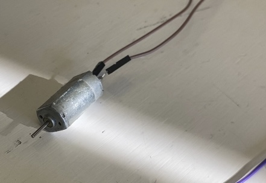
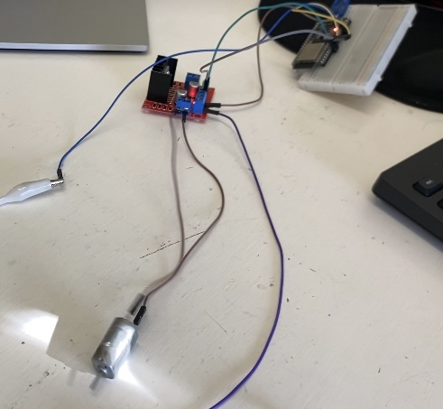

#Tercer Proyecto

###Nombre del proyecto:Control de motor DC 

###Autores
- Barrientos Miguel Leonardo
- Zermeño Cervantes Rodrigo

###Asignatura: Introducción a la Mecatronica

###Fecha: 19 de Septiembre del 2025

###Descripción
En este tercer proyecto de la materia **Introducción a la Mecatrónica**, nuestro objetivo fue realizar la conexión y programación de un **motor DC** para lograr su **encendido, apagado y control de velocidad** utilizando un **Arduino/ESP32**.  
Usamos los pines digitales y la función `ledcWrite()` para variar la velocidad del motor mediante la técnica de modulación por ancho de pulso (PWM).


                         
##Objetivos

###General
Aprender a **controlar un motor DC** utilizando un microcontrolador, comprendiendo el funcionamiento de los pines de salida y el control de velocidad por PWM.

###Especificos

- Programar el encendido y cambio de giro del motor.  
- Implementar el control de velocidad mediante la función `ledcWrite()`.  
- Comprender la relación entre frecuencia, ciclo de trabajo y velocidad del motor.

##Alcance y Exclusiones
 -**Incluye**:

- Conexión del motor DC a través del driver y pines de salida del Arduino/ESP32.  
- Código para encendido, apagado y cambio de giro.  
- Código con control progresivo de velocidad.  

 -**No Incluye**: 

##Procedimiento
Primero identificamos los pines de salida del microcontrolador y realizamos las conexiones correspondientes del motor.  
Una vez conectado, programamos un código sencillo que permitiera **encender el motor en una dirección, detenerlo y hacerlo girar en sentido contrario** con intervalos de tres segundos entre cada encendido.  
Este fue nuestro primer código funcional:

---

###Código 1
```cpp
#define in1 32
#define in2 33

void setup() {
  pinMode(in1, OUTPUT);
  pinMode(in2, OUTPUT);
}

void loop() {
  digitalWrite(in1,1);
  digitalWrite(in2,0);
  delay(3000);
  digitalWrite(in1,0);
  digitalWrite(in2,0);
  delay(3000);
  digitalWrite(in1,0);
  digitalWrite(in2,1);
  delay(3000);
}

```


Como segunda parte de este proyecto, en base a lo anteriormente realizado teniamos que programar el motor de manera que pudiesemos **controlar su velocidad** y que este **aumentara y disminuyera gradualmente** su velocidad en lugar de detenerse o empezar a avanzar repentinamente. Esto debido a que traducido a un motor real, si llegase a suceder, podria ocurrir una perdida de control o incluso un degaste innecesario en el mecanismo.

A continuación el segundo codigo que ocupamos para esta segunda parte del proyecto:

---

###Código 2
```cpp
pinMode(in1, OUTPUT);
  pinMode(in2, OUTPUT);
  //Control de velocidad
  ledcAttachChannel(pwm,1000,8,0); //pin,frecuencia,bits,canal   //config
 
}
 
void loop() {
 
  for(vel=0; vel<=256;vel++){
  ledcWrite(pwm,vel);
  digitalWrite(in1,1);
  digitalWrite(in2,0);
  delay(10);
  }
 
  for(vel=256;vel>=0;vel--){
  digitalWrite(in1,1);
  digitalWrite(in2,0);
  delay(10);
 
 
  }
 
 
 
 
}
```

A continuación imagenes del motor conectado a un puente H que conectaba con el Arduino/ESP32 para poder recibir la programación de los códigos previamente vistos



Foto del motor utilizado en cuestión para este proyecto



